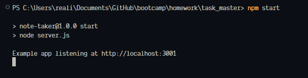
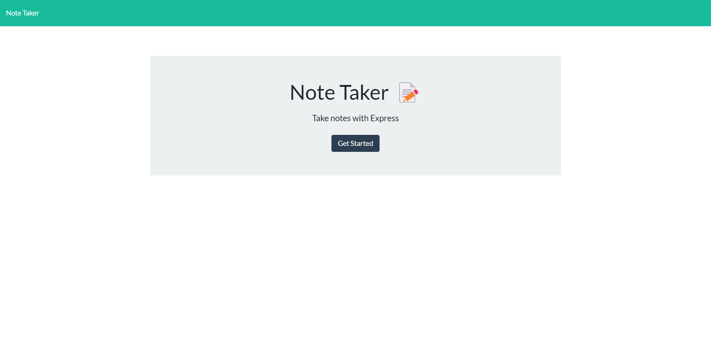
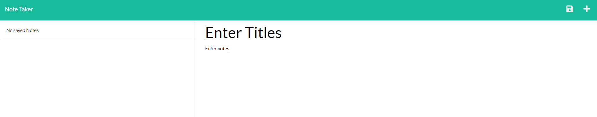
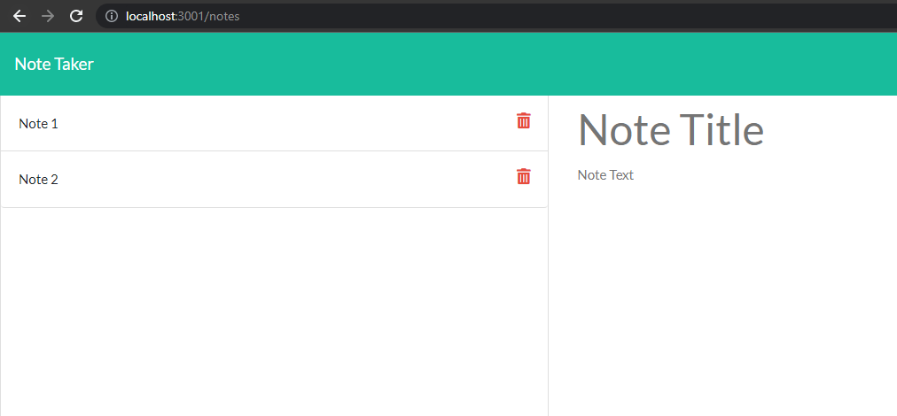

# Task Master

## Description

Simple task keeping application built with expressjs and node. You can enter the title of the note and the body of it. You can also then save it and its persistent between opening. You can also remove the notes when they are no longer needed.

## Table Of Cotents

- [Description](#description)
- [Requirements](#requirments)
- [Installation](#installation)
- [Usage](#usage)
- [Deployed](#deploy)

## Requirments

To run this you need to hae npm installed and nodejs installed.

## Installation
To get this up and runing simply download the repo. Extract and navigate your browser to the location of the index.js. Run `npm install` to get the required `npm modules`.

## Usage
Very simple to use first navigate to the folder where it was extracted to. Next run `npm start`.

Then you can control + click the link in the termal. That will take you to the browser.

You will be brought to the lander page. To get started press the "Get Started" button.

Now you are brought to where you can enter the title of the note. Then you can enter the body of the note and save it with the button in the top right.

You can select what note you would like to view by click the name on the left.

## Deployed

You can test it out [here](http://mineboss.asuscomm.com:56734/)
